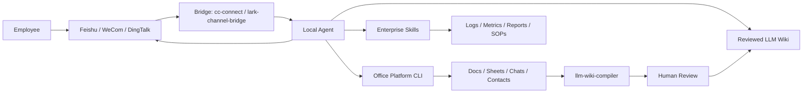

# FDE-Kit

Enterprise AI workbench deployment guide for Forward Deployed Engineers.

FDE-Kit documents a staged path for turning a local coding Agent into a team-accessible enterprise AI assistant. It combines a local Agent runtime, a collaboration bridge, office-platform CLIs, `llm-wiki-compiler`, and customer-specific Skills into one controlled deployment workflow.

中文版本：[README.md](README.md)

## System Overview



The target outcome:

> A team-accessible AI workbench that can read approved company context, answer with sources, and execute approved workflows inside clear security boundaries.

## Deployment Roadmap

```text
Step 0  Local Agent Runtime
Step 1  Collaboration Bridge
Step 2  Enterprise Data Access
Step 3  LLM Wiki
Step 4  Enterprise Skills
Step 5  Governance
```

Steps 0-3 create the infrastructure.  
Step 4 creates the business value.  
Step 5 makes the system safe enough to operate.

## Requirements

- macOS or Windows
- Node.js >= 24
- npm
- A local Agent runtime: Claude Code, Codex, Cursor, Gemini CLI, OpenCode, or equivalent
- A supported chat platform: Feishu, WeCom, DingTalk, Slack, Telegram, Discord, QQ, or equivalent
- Approved test documents
- A dedicated workspace directory

Check Node.js:

```bash
node -v
npm -v
```

Install Node.js if needed:

```bash
# macOS
brew install node
```

```powershell
# Windows
winget install OpenJS.NodeJS
```

## Step 0: Local Agent Runtime

Install and verify a local Agent runtime before connecting it to any company system.

Recommended options:

- Claude Code
- Codex
- Claude Code with a lower-cost model provider for cost-sensitive enterprise use, such as DeepSeek, GLM, or Kimi

Claude Code:

```bash
npm install -g @anthropic-ai/claude-code
claude --version
```

Verification:

```text
The Agent can operate inside a dedicated test directory.
```

## Step 1: Collaboration Bridge

The bridge exposes the local Agent to team chat. Do not assume there is only one correct bridge. Pick it based on the customer's collaboration platform.

### Option A: cc-connect, general multi-platform bridge

`cc-connect` is a good default for multi-platform and multi-agent FDE delivery.

Use it when:

- The customer may use Feishu, WeCom, DingTalk, or another chat platform
- You need to bridge different Agent runtimes such as Claude Code, Codex, Gemini CLI, Cursor, or OpenCode
- You want one standard access layer across platforms

Install:

```bash
npm install -g cc-connect
cc-connect --version
```

Generate a version-matched config:

```bash
cc-connect config example > cc-connect.toml
```

Configure one platform first. For Feishu:

```bash
cc-connect feishu setup
```

For an existing Feishu app:

```bash
cc-connect feishu setup --app <app_id:app_secret>
```

or:

```bash
cc-connect feishu bind --app <app_id:app_secret>
```

Key fields to verify in `cc-connect.toml`:

```text
project.name
projects.agent.type
projects.agent.options.work_dir
projects.platforms.type
projects.platforms.options.app_id
projects.platforms.options.app_secret
projects.platforms.options.allow_from
```

`allow_from` should be explicitly configured for authorized users when moving beyond a local test.

Start:

```bash
cc-connect --config ./cc-connect.toml
```

Verification:

```text
A user can send a message from the chat platform and receive a response from the local Agent.
```

Implementation note: this guide has been validated with Feishu first. Other supported platforms should be verified independently.

### Option B: lark-channel-bridge, Feishu-first bridge

If the customer mainly uses Feishu/Lark, `lark-channel-bridge` is often the better first bridge. It is not trying to be cross-platform. It focuses on making local Claude Code feel native inside Feishu.

Use it when:

- Feishu is the customer's main work surface
- You want a QR-code wizard to create or bind a Feishu app quickly
- You want streaming cards instead of waiting for the final answer
- You want Claude Code sessions scoped by chat, topic, or workspace
- You want the bot to respond when mentioned in Feishu cloud-doc comments and reply in the same comment thread
- You need built-in access control for users, chats, and admins

Install:

```bash
npm install -g lark-channel-bridge
lark-channel-bridge --help
```

First run:

```bash
lark-channel-bridge run
```

The first run opens a QR-code wizard. Scan it with Feishu/Lark, then pick or create a PersonalAgent app. Credentials are written to the local config.

Useful in-chat commands:

```text
/ws list        List workspaces
/ws save <name> Save current cwd as a workspace
/ws use <name>  Switch workspace
/cd <path>      Switch working directory
/status         Show current session status
/config         Configure reply style, access control, and other options
/stop           Stop the current run
/doctor         Ask the Agent to inspect recent logs and diagnose itself
```

Access control:

```text
allowedUsers   # User open_id allowlist
allowedChats   # Group chat_id allowlist
admins         # Admins allowed to change config, switch workspace, and run management commands
```

For production or customer environments, configure at least `allowedUsers` or `allowedChats`. If these are left open, anyone who can DM the bot or mention it in a group may trigger the local Agent.

Verification:

```text
A user can DM the Feishu bot, mention it in a group, or mention it in a cloud-doc comment and receive a local Claude Code response.
```

Selection rule:

```text
Feishu-only customer demo: prefer lark-channel-bridge
Cross-platform FDE delivery: prefer cc-connect
Feishu cloud-doc comment mentions: prefer lark-channel-bridge
WeCom, DingTalk, or multiple Agent runtimes: prefer cc-connect
```

## Step 2: Enterprise Data Access

The chat bridge makes the Agent reachable. Enterprise data access makes it useful.

Install the CLI, MCP server, or internal tool adapter for the selected office platform. The first integration should be read-only and limited to an approved test space.

For Feishu/Lark:

```bash
npm install -g @larksuite/cli
lark-cli --help
lark-cli config init
lark-cli auth login
lark-cli doctor
```

Typical capabilities:

- Search documents
- Read documents
- Read spreadsheets
- Search contacts
- Send progress reports to approved chats
- Upload generated files or images

Verification:

```text
The Agent can read one approved test document and send one test report to one approved chat.
```

## Step 3: LLM Wiki

`llm-wiki-compiler` turns approved source documents into a reviewed LLM Wiki.

Install:

```bash
npm install -g llm-wiki-compiler
llmwiki --help
```

Create a test workspace:

```bash
mkdir -p ~/fde-demo/sources
cd ~/fde-demo
```

Windows PowerShell:

```powershell
mkdir $env:USERPROFILE\fde-demo\sources
cd $env:USERPROFILE\fde-demo
```

Create `sources/example.md`:

```markdown
# Example Company SOP

## P0 Incident Response

For P0 incidents, create an incident channel, assign an owner, check dashboards,
and post updates every 15 minutes.

## External SaaS Subscription

Employees should confirm with finance before subscribing to external SaaS tools.
```

Compile:

```bash
llmwiki schema init
llmwiki compile --review --lang zh-CN
llmwiki review list
llmwiki review show <candidate-id>
llmwiki review approve <candidate-id>
llmwiki lint
llmwiki view
```

Query:

```bash
llmwiki query "P0 事故应该怎么处理？"
```

Verification:

```text
Known documented questions are answered from reviewed wiki content.
Undocumented policy questions are answered as "not documented" instead of being invented.
```

## Step 4: Enterprise Skills

Skills convert infrastructure into business workflows.

A Skill is a repeatable procedure with:

- trigger
- inputs
- approved tools
- execution steps
- output format
- permission boundary
- failure handling

### Log Diagnosis Skill

Trigger:

```text
Investigate this failed request: trace_id=xxx
```

Procedure:

```text
1. Validate the trace ID.
2. Query approved logs.
3. Identify request path, user scope, and error class.
4. Check related metrics if available.
5. Produce a short diagnosis and next action.
6. Report to the approved chat if requested.
```

### API Delivery Verification Skill

Trigger:

```text
Verify this API change before delivery.
```

Procedure:

```text
1. Read the requirement and API path.
2. Run tests.
3. Send smoke requests.
4. Check logs and metrics.
5. Produce a pass/fail/risk report.
```

### Content Review Skill

Trigger:

```text
Review this batch of user-generated content.
```

Procedure:

```text
1. Read approved data.
2. Apply review criteria.
3. Produce structured decisions.
4. Write results to the approved destination.
5. Flag samples for human review.
```

### Competitive Monitoring Skill

Trigger:

```text
Summarize recent competitor activity.
```

Procedure:

```text
1. Read approved keywords and competitors.
2. Search public sources.
3. Extract titles, engagement, and claims.
4. Cluster topics.
5. Produce a report for the approved chat.
```

### SOP Execution Skill

Trigger:

```text
Run the release checklist.
```

Procedure:

```text
1. Read the approved SOP.
2. Check required items.
3. Confirm owners.
4. Confirm rollback and monitoring.
5. Produce a go/no-go summary.
```

### Wiki Update Skill

Trigger:

```text
Convert this incident review into wiki updates.
```

Procedure:

```text
1. Extract timeline, impact, cause, and fix.
2. Draft a postmortem.
3. Draft a reusable incident pattern.
4. Submit both to human review.
5. Publish only after approval.
```

### Short Video Production Skill / MoneyPrinterTurbo

`MoneyPrinterTurbo` is a short-video automation pipeline: given a topic or keyword, it can generate a script, find copyright-free stock footage, synthesize voiceover, generate subtitles and background music, then render a short video.

Repository: <https://github.com/harry0703/MoneyPrinterTurbo>

It belongs in Step 4 as an optional content-production workflow tool, not as core enterprise AI workbench infrastructure.

Good fits:

- Generate short-video drafts in batches for topic testing.
- Turn company knowledge, product selling points, or SOPs into low-cost video material.
- Use it as an FDE workflow example: LLM script generation → material retrieval → TTS → subtitles → video rendering.

Poor fits:

- Content that depends on strong personal style, on-camera expression, or trust building.
- Enterprise content that needs strict fact checking or approved media assets.
- Directly publishing unaudited AI-generated videos at scale.

Minimum validation:

```text
Input one business topic and generate one 30-60 second vertical video draft.
Human-review the script, footage, subtitles, and factual accuracy.
Only include it in a production Skill if the editing cost is lower than making the video from scratch.
```

Verification:

```text
At least one Skill completes a real workflow end to end and produces an auditable report.
```

## Step 5: Governance

Minimum operating controls:

- Dedicated OS user or isolated server
- Dedicated workspace directory
- Chat allowlist
- Source document allowlist
- Read-only first integration
- Human review before wiki publication
- No secrets, credentials, contracts, salaries, or private customer data in sources
- Unknown-question capture process
- Regular wiki lint and review

Verification:

```text
The Agent can answer known questions, refuse undocumented questions, and operate only inside the intended data boundary.
```

## LLM Wiki vs Direct RAG

| Dimension | Direct RAG | LLM Wiki |
|---|---|---|
| Knowledge form | Query-time chunks | Precompiled Markdown pages |
| Reviewability | Usually answer-level only | Wiki pages can be reviewed before use |
| Source traceability | Depends on retrieval | Built into pages and citations |
| Reuse | Re-discovered per query | Accumulates as stable knowledge assets |
| Best for | Large ad-hoc search | SOPs, policies, incident reviews, manuals |
| Main risk | Plausible but unapproved answers | Slower setup, stronger control |

FDE-Kit does not replace RAG. It defines when enterprise knowledge should become a reviewed asset before being used by an Agent.

## Delivery Checklist

```text
[ ] Step 0: Local Agent works inside a test directory
[ ] Step 1: A bridge is selected and chat can reach the Agent
[ ] Step 2: Agent can access one approved test document
[ ] Step 3: LLM Wiki compiles and answers from reviewed content
[ ] Step 4: One enterprise Skill completes a real workflow
[ ] Step 5: Permissions, review, and operations are documented
```

## Public Safety Baseline

Public examples should use generic data only.

Avoid publishing:

- real project names
- internal domains
- production paths
- employee information
- customer information
- secrets or credentials
- raw incident records
- unreleased business plans

## Scope

FDE-Kit is a deployment guide and operating model for FDE-style enterprise AI workbench projects.

Current scope:

- staged deployment guidance;
- operating boundaries;
- reviewed knowledge workflow;
- Skill design examples.

Out of scope for the current version:

- SaaS UI;
- one-command installation;
- automatic ingestion of unreviewed company documents;
- guarantees for answers based on unapproved sources.

The expected result is a controlled path from local Agent to enterprise AI workbench.
