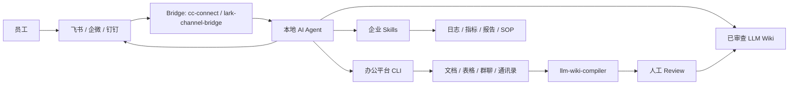

# FDE-Kit

面向 Forward Deployed Engineer（FDE）的企业 AI 工作台部署指南。

FDE-Kit 记录了一条分阶段的部署路线：把本地 AI Agent 变成团队可访问、可审查、可治理的企业 AI 助手。它把本地 Agent Runtime、协作入口 Bridge、办公平台 CLI、`llm-wiki-compiler` 和企业定制 Skills 串成一套可交付流程。

English version: [README.en.md](README.en.md)

## 系统架构



目标结果：

> 搭建一个团队可访问的企业 AI 工作台：它能读取授权的企业上下文，基于来源回答问题，并在明确的安全边界内执行工作流。

## 部署路线图

```text
Step 0  本地 Agent Runtime
Step 1  协作入口 Bridge
Step 2  企业数据访问
Step 3  LLM Wiki
Step 4  企业 Skills
Step 5  Governance
```

Step 0-3 建立基础设施。  
Step 4 产生业务价值。  
Step 5 让系统具备企业级运行边界。

## 环境要求

- macOS 或 Windows
- Node.js >= 24
- npm
- 一个本地 Agent Runtime：Claude Code、Codex、Cursor、Gemini CLI、OpenCode 或同类工具
- 一个企业聊天平台：飞书、企微、钉钉、Slack、Telegram、Discord、QQ 或同类平台
- 一批已授权的测试文档
- 一个专用工作目录

检查 Node.js：

```bash
node -v
npm -v
```

安装 Node.js：

```bash
# macOS
brew install node
```

```powershell
# Windows
winget install OpenJS.NodeJS
```

## Step 0：本地 Agent Runtime

先安装并验证一个本地 Agent Runtime，再把它接入任何企业系统。

推荐选项：

- Claude Code
- Codex
- Claude Code + 低成本模型供应商，例如 DeepSeek、GLM、Kimi

安装 Claude Code：

```bash
npm install -g @anthropic-ai/claude-code
claude --version
```

验证：

```text
Agent 能在一个专用测试目录内读写文件、执行任务。
```

## Step 1：协作入口 Bridge

Bridge 用来把本地 Agent 暴露给团队聊天平台。这里不要默认只有一种方案，按客户的办公平台选择。

### 方案 A：cc-connect（通用多平台）

`cc-connect` 适合多平台、多 Agent 的通用 FDE 交付。

适合场景：

- 客户不只使用飞书，还可能使用企微、钉钉或其他聊天平台
- 需要同时桥接 Claude Code、Codex、Gemini CLI、Cursor、OpenCode 等不同 Agent Runtime
- 需要一套跨平台的标准接入层

安装：

```bash
npm install -g cc-connect
cc-connect --version
```

生成与当前版本匹配的配置：

```bash
cc-connect config example > cc-connect.toml
```

先配置一个平台。以飞书为例：

```bash
cc-connect feishu setup
```

绑定已有飞书应用：

```bash
cc-connect feishu setup --app <app_id:app_secret>
```

或：

```bash
cc-connect feishu bind --app <app_id:app_secret>
```

在 `cc-connect.toml` 里重点确认：

```text
project.name                              # 项目名称
projects.agent.type                       # Agent 类型
projects.agent.options.work_dir           # Agent 工作目录
projects.platforms.type                   # 平台类型
projects.platforms.options.app_id         # 平台应用 ID
projects.platforms.options.app_secret     # 平台应用密钥
projects.platforms.options.allow_from     # 授权用户白名单
```

进入团队试点前，`allow_from` 应该明确限制授权用户。

启动：

```bash
cc-connect --config ./cc-connect.toml
```

验证：

```text
用户能从聊天平台发送消息，并收到本地 Agent 的回复。
```

实现说明：这份指南优先验证飞书路径。其他平台虽然由 `cc-connect` 支持，但需要按对应平台单独验证。

### 方案 B：lark-channel-bridge（飞书专精）

如果客户主要使用飞书，`lark-channel-bridge` 更适合作为首选 Bridge。它的目标不是跨平台，而是把本地 Claude Code 更深地接入飞书使用场景。

适合场景：

- 客户主要工作入口是飞书
- 希望通过扫码向导快速创建或绑定飞书应用
- 希望在飞书里看到流式卡片，而不是等待整段回复完成
- 需要按聊天、话题或 workspace 管理 Claude Code 会话
- 需要在飞书云文档评论里 @bot，并让 Agent 回到同一个评论线程
- 需要内置访问控制，限制哪些人、哪些群、哪些管理员可以调用 Agent

安装：

```bash
npm install -g lark-channel-bridge
lark-channel-bridge --help
```

首次运行：

```bash
lark-channel-bridge run
```

首次运行会打开二维码向导，用飞书扫码后选择或创建 PersonalAgent 应用，凭证会写入本地配置。

常用命令：

```text
/ws list        查看 workspace
/ws save <name> 保存当前工作目录为 workspace
/ws use <name>  切换 workspace
/cd <path>      切换工作目录
/status         查看当前会话状态
/config         配置回复模式、访问控制等选项
/stop           中断当前运行
/doctor         让 Agent 读取近期日志并自诊断
```

访问控制：

```text
allowedUsers   # 允许调用 Agent 的用户 open_id 列表
allowedChats   # 允许触发 Agent 的群 chat_id 列表
admins         # 允许修改配置、切换 workspace、执行管理命令的管理员列表
```

生产或客户环境中，应该至少配置 `allowedUsers` 或 `allowedChats`。如果不配置，任何能 DM 机器人或在群里 @机器人的人，都可能触发本地 Agent。

验证：

```text
用户能在飞书私聊、群聊 @bot、或云文档评论 @bot，并收到本地 Claude Code 的回复。
```

选型建议：

```text
只做飞书客户 Demo：优先 lark-channel-bridge
做跨平台 FDE 交付：优先 cc-connect
需要飞书文档评论 @bot：优先 lark-channel-bridge
需要企微/钉钉/多 Agent Runtime：优先 cc-connect
```

## Step 2：企业数据访问

Chat Bridge 让 Agent 能被访问。企业数据访问让 Agent 真正有用。

为选定的办公平台安装 CLI、MCP Server 或内部工具适配器。第一阶段建议只读，并限制在已批准的测试空间内。

飞书 / Lark：

```bash
npm install -g @larksuite/cli
lark-cli --help
lark-cli config init
lark-cli auth login
lark-cli doctor
```

典型能力：

- 搜索文档
- 读取文档
- 读取表格
- 查询通讯录
- 向授权群聊发送进度汇报
- 上传生成的文件或图片

### 外部网页 / 系统操作：OpenCLI

很多企业 AI 落地并不是第一天就能拿到完整 API。更常见的是：关键流程已经在网页后台、SaaS 系统、公开网站或旧管理系统里运行。FDE 需要让 Agent 能稳定读取网页、操作表单、下载资料、整理结果，并在高风险动作前交给人工确认。

`OpenCLI` 可以把网站和网页操作暴露成 Agent 可调用的 CLI。

安装与检查：

```bash
npm install -g @jackwener/opencli
opencli --help
opencli list
```

适合场景：

- 公开网页调研和资料读取。
- 竞品监控、线索收集、招聘/商品/内容页面整理。
- 操作已有 SaaS 或后台系统中的重复流程。
- 在没有 API 或 API 接入成本过高时，先做浏览器自动化 PoC。

安全边界：

- 不绕过登录、权限、风控或付费边界。
- 不批量抓取敏感或未授权数据。
- 涉及付款、删除、提交合同、发送外部消息等高风险写操作时，必须人工确认。
- 复用登录态时应使用隔离的站点会话，避免污染个人浏览器环境。

验证：

```text
Agent 能通过 OpenCLI 读取一个授权网页，提取结构化信息，并生成可审查摘要。
如需写入或提交，必须先输出预览并等待人工确认。
```

Step 2 总体验证：

```text
Agent 能读取一份授权测试文档，读取一个授权网页，并向一个授权群聊发送一条测试汇报。
```

## Step 3：LLM Wiki

`llm-wiki-compiler` 用来把授权源文档编译成可审查的 LLM Wiki。

安装：

```bash
npm install -g llm-wiki-compiler
llmwiki --help
```

创建测试工作区：

```bash
mkdir -p ~/fde-demo/sources
cd ~/fde-demo
```

Windows PowerShell：

```powershell
mkdir $env:USERPROFILE\fde-demo\sources
cd $env:USERPROFILE\fde-demo
```

创建 `sources/example.md`：

```markdown
# 示例公司 SOP

## P0 事故响应流程

发生 P0 事故时，创建事故群，指定唯一负责人，检查监控面板，并每 15 分钟同步一次进展。

## 外部 SaaS 订阅

员工订阅外部 SaaS 工具前，应先向财务确认报销和续费规则。
```

编译：

```bash
llmwiki schema init
llmwiki compile --review --lang zh-CN
llmwiki review list
llmwiki review show <candidate-id>
llmwiki review approve <candidate-id>
llmwiki lint
llmwiki view
```

查询：

```bash
llmwiki query "P0 事故应该怎么处理？"
```

验证：

```text
已记录的问题能从已审查 Wiki 内容中回答。
未记录的制度问题会被标记为“未文档化”，而不是被编造。
```

## Step 4：企业 Skills

Skills 把基础设施转化成业务工作流。

一个 Skill 是一套可重复执行的流程，包含：

- 触发条件
- 输入
- 授权工具
- 执行步骤
- 输出格式
- 权限边界
- 失败处理

### 日志诊断 Skill

触发：

```text
排查这个失败请求：trace_id=xxx
```

流程：

```text
1. 校验 trace_id。
2. 查询授权日志。
3. 识别请求路径、用户范围和错误类型。
4. 必要时检查相关指标。
5. 输出诊断结论和下一步动作。
6. 如有需要，汇报到授权群聊。
```

### API 交付验收 Skill

触发：

```text
这个 API 改动准备交付，帮我做一次验收。
```

流程：

```text
1. 读取需求和 API 路径。
2. 运行测试。
3. 发送冒烟请求。
4. 检查日志和指标。
5. 输出通过 / 失败 / 风险报告。
```

### 内容审核 Skill

触发：

```text
审核这一批用户内容。
```

流程：

```text
1. 读取授权数据。
2. 应用审核标准。
3. 输出结构化审核决策。
4. 写入授权目标位置。
5. 标记需要人工复核的样本。
```

### 竞品监控 Skill

触发：

```text
总结最近的竞品动态。
```

流程：

```text
1. 读取授权关键词和竞品列表。
2. 通过 OpenCLI / 搜索工具读取公开来源。
3. 提取标题、互动数据和核心主张。
4. 聚类选题方向。
5. 向授权群聊输出报告。
```

### 浏览器自动化 Skill / OpenCLI

触发：

```text
帮我把这个网页后台里的待处理线索整理成跟进表。
```

流程：

```text
1. 确认目标网站、账号权限和允许操作范围。
2. 使用 OpenCLI 读取页面、表格、搜索结果或后台列表。
3. 提取结构化字段，生成可审查表格或报告。
4. 对任何写入、提交、删除、付款、外发消息动作先生成预览。
5. 等待人工确认后再执行高风险写操作。
```

适合 PoC：

```text
没有 API 的旧后台 / SaaS / 公开网页，也可以先通过浏览器自动化验证流程价值。
```

### SOP 执行 Skill

触发：

```text
执行发布检查清单。
```

流程：

```text
1. 读取已批准的 SOP。
2. 检查必要项目。
3. 确认负责人。
4. 确认回滚和监控方案。
5. 输出发布 / 暂停发布摘要。
```

### Wiki 更新 Skill

触发：

```text
把这次事故复盘整理成 Wiki 更新。
```

流程：

```text
1. 提取时间线、影响范围、原因和修复动作。
2. 起草复盘文档。
3. 起草可复用的事故模式。
4. 提交人工 review。
5. 审批后发布。
```

### 短视频生产 Skill / MoneyPrinterTurbo

`MoneyPrinterTurbo` 是一个短视频自动化流水线：输入主题或关键词，自动生成视频文案、搜索无版权素材、合成配音、生成字幕和背景音乐，最后输出短视频。

仓库：<https://github.com/harry0703/MoneyPrinterTurbo>

适合放在 FDE-Kit 的 Step 4，作为“内容生产工作流”的候选工具，而不是企业 AI 工作台的基础设施。

适合场景：

- 批量生成短视频草稿，用于选题测试。
- 把企业知识、产品卖点或 SOP 转成低成本视频素材。
- 作为 FDE 工作流案例：LLM 生成脚本 → 素材检索 → TTS → 字幕 → 视频合成。

不适合场景：

- 需要强个人风格、真人表达和信任建设的内容。
- 需要严谨事实核查或未授权素材的企业内容。
- 直接批量发布未经人工审核的 AI 味视频。

最小验证：

```text
输入一个业务主题，生成 1 条 30-60 秒竖屏视频草稿。
人工检查脚本、素材、字幕和事实准确性。
如果人工修改成本低于从零制作，才纳入内容生产 Skill。
```

验证：

```text
至少一个 Skill 能端到端完成真实工作流，并产出可审计报告。
```

## Step 5：Governance

最低运行控制：

- 专用 OS 用户或隔离服务器
- 专用工作目录
- 聊天白名单
- 源文档白名单
- 第一次集成优先只读
- Wiki 发布前必须人工 review
- 源文档中不放密钥、凭证、合同、工资、客户隐私数据
- 未知问题捕获流程
- 定期 wiki lint 和 review

验证：

```text
Agent 能回答已知问题，拒绝未文档化问题，并只在预期数据边界内运行。
```

## LLM Wiki vs 直接 RAG

| 维度 | 直接 RAG | LLM Wiki |
|---|---|---|
| 知识形态 | 查询时临时检索 chunks | 预先编译成 Markdown 页面 |
| 可审查性 | 通常只能审查最终回答 | Wiki 页面可在使用前审查 |
| 来源追溯 | 依赖检索结果 | 页面和引用中内置来源 |
| 复用性 | 每次查询重新发现 | 持续沉淀为稳定知识资产 |
| 适用场景 | 大规模临时搜索 | SOP、制度、复盘、手册 |
| 主要风险 | 回答看似合理但未被批准 | 前期设置较慢，但控制更强 |

FDE-Kit 不替代 RAG。它定义的是：什么时候企业知识应该先变成可审查资产，再交给 Agent 使用。

## 交付检查清单

```text
[ ] Step 0: 本地 Agent 能在测试目录内运行
[ ] Step 1: 已选择 Bridge，聊天平台能桥接到 Agent
[ ] Step 2: Agent 能访问一份授权测试文档
[ ] Step 3: LLM Wiki 能编译，并基于已审查内容回答
[ ] Step 4: 至少一个企业 Skill 能完成真实工作流
[ ] Step 5: 权限、审查和运营流程已文档化
```

## 公开安全基线

公开示例只使用通用数据。

避免发布：

- 真实项目名
- 内部域名
- 生产路径
- 员工信息
- 客户信息
- 密钥或凭证
- 原始事故记录
- 未发布商业计划

## 范围

FDE-Kit 是 FDE 风格企业 AI 工作台项目的部署指南和运行模型。

当前范围：

- 分阶段部署指南
- 运行边界
- 可审查知识工作流
- Skill 设计示例

暂不包含：

- SaaS 界面
- 一键安装脚本
- 自动导入未经审查的公司文档
- 对未批准来源的回答正确性保证

预期结果是一条从本地 Agent 到企业 AI 工作台的可控路径。
