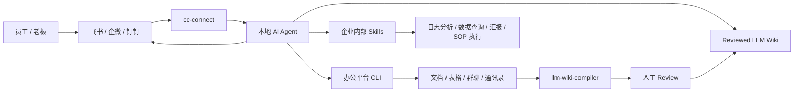

# fde-kit

`fde-kit` 不是一个新的软件包。

它是一份企业 FDE 安装路线图：一步一步引导你把本地 AI Agent 接进企业办公系统，并逐步让它理解企业知识、执行企业内部工作流。

核心工具：

- 本地 Agent：Claude Code / Codex / Cursor / Gemini / OpenCode
- 模型供应商：Claude / OpenAI / DeepSeek / GLM / Kimi 等
- `cc-connect`：把本地 Agent 接进飞书、企微、钉钉等聊天平台
- 办公平台 CLI：让 Agent 能访问企业文档、群聊、通讯录、表格等数据
- `llm-wiki-compiler`：把企业已有文档编译成 LLM Wiki
- 企业内部 Skills：把具体工作流沉淀成可复用能力

## 你要搭出来的东西

```text
员工在飞书/企微/钉钉提问
  -> cc-connect
  -> 本地 AI Agent
  -> 办公平台 CLI / LLM Wiki / 企业 Skills
  -> 带来源、带动作结果的回答回到群里
```

这不是“装一个聊天机器人”。

它的目标是：

> 给企业装一个可控、可审查、可扩展的 AI 工作台，让 AI 不只会聊天，还能读企业文档、理解业务上下文，并执行具体工作流。

## Architecture



## 总路线

```text
Step 0  安装本地 Agent
Step 1  安装 cc-connect，让 Agent 进入企业聊天工具
Step 2  安装办公平台 CLI，让 Agent 能访问企业数据
Step 3  安装 LLM Wiki，让 Agent 吸收存量知识
Step 4  编写企业内部 Skills，让 Agent 执行真实工作
Step 5  做权限、安全、审查和运营
```

前 3 步是地基。  
第 4 步才是 FDE 的核心交付。  
第 5 步决定这套东西能不能在企业里长期跑。

## Step 0：安装本地 Agent

先让企业内部有一个能在本机执行任务的 AI Agent。

先确认 Node.js 版本。后面的 `llm-wiki-compiler` 要求 Node.js >= 24：

```bash
node -v
npm -v
```

如果版本不够：

```bash
# macOS
brew install node
```

```powershell
# Windows
winget install OpenJS.NodeJS
```

推荐优先级：

1. **Claude Code**
   - 能力强，生态成熟。
   - 适合复杂代码、文档、自动化任务。

2. **Codex**
   - 适合工程师环境。
   - 对代码仓库和工具调用友好。

3. **Claude Code + 国产大模型网关**
   - 适合大部分企业场景。
   - 成本更低。
   - 可选模型：DeepSeek、GLM、Kimi 等。

安装 Claude Code：

```bash
npm install -g @anthropic-ai/claude-code
claude --version
```

安装 Codex 按对应官方文档完成即可。

判断 Step 0 成功的标准：

```text
你可以在本地终端里打开 Agent，并让它读写一个测试目录里的文件。
```

不要一开始就给它全盘权限。先用一个干净目录测试。

## Step 1：安装 cc-connect

`cc-connect` 的作用是把本地 Agent 接进企业聊天工具。

装完后，同事就能在飞书、企微、钉钉等地方访问这个 Agent，而不是只能由你一个人在终端里用。

安装：

```bash
npm install -g cc-connect
cc-connect --version
```

先看配置示例：

```bash
cc-connect config example > cc-connect.toml
```

然后打开 `cc-connect.toml`，按注释删掉不需要的平台，只保留你要接的平台。

飞书向导：

```bash
cc-connect feishu setup
```

或绑定已有飞书应用：

```bash
cc-connect feishu setup --app <app_id:app_secret>
```

也可以用：

```bash
cc-connect feishu bind --app <app_id:app_secret>
```

不要在 README 里手写完整 `cc-connect.toml`。以当前版本的 `cc-connect config example` 输出为准，避免版本升级后配置格式漂移。

你真正需要确认的是这几个字段：

```text
project.name
projects.agent.type
projects.agent.options.work_dir
projects.platforms.type
projects.platforms.options.app_id
projects.platforms.options.app_secret
projects.platforms.options.allow_from
```

`allow_from` 不要随便填空字符串。要么按示例注释处理，要么填明确授权的 open_id。

启动：

```bash
cc-connect --config ./cc-connect.toml
```

判断 Step 1 成功的标准：

```text
你在飞书/企微/钉钉里发消息，Agent 能回复。
```

注意：`cc-connect` 支持飞书、企微、微信、钉钉、Slack、Telegram、Discord、QQ 等多个平台。但这份指南当前本地验证过的是飞书；其他平台请按 `cc-connect` 对应平台文档验证。

## Step 2：安装办公平台 CLI

有了 `cc-connect`，Agent 能被同事访问。

但它还不一定能读企业数据。

所以第二步要给 Agent 装对应办公平台的 CLI 或插件，让它能访问：

- 云文档
- 表格
- 群聊
- 通讯录
- 文件
- 机器人消息
- 进度汇报渠道

以飞书为例，CLI 能力应该覆盖：

```text
搜索飞书文档
读取飞书文档
读取电子表格
查询通讯录
给群里发送汇报
上传文件或图片
```

判断 Step 2 成功的标准：

```text
Agent 能按你的授权读取一份测试飞书文档，并能在指定群里发一条测试汇报。
```

这一步必须遵守权限边界。

不要让 Agent 默认遍历全部公司文档。应该先给一个白名单文件夹或测试空间。

## Step 3：安装 LLM Wiki

`LLM Wiki` 是可选步骤，但很关键。

它的作用不是让 Agent “多一个知识库”，而是让 Agent 能把企业已有文档消化成一种更适合大模型读取、也更适合人工审查的结构。

安装：

```bash
npm install -g llm-wiki-compiler
llmwiki --help
```

创建隔离目录：

```bash
mkdir -p ~/fde-demo/sources
cd ~/fde-demo
```

Windows PowerShell：

```powershell
mkdir $env:USERPROFILE\fde-demo\sources
cd $env:USERPROFILE\fde-demo
```

准备假数据 `sources/example.md`：

```markdown
# Example Company SOP

## P0 Incident Response

For P0 incidents, create an incident channel, assign an owner, check dashboards,
and post updates every 15 minutes.

## External SaaS Subscription

Employees should confirm with finance before subscribing to external SaaS tools.
```

编译：

```bash
llmwiki schema init
llmwiki compile --review --lang zh-CN
llmwiki review list
llmwiki review show <candidate-id>
llmwiki review approve <candidate-id>
llmwiki lint
llmwiki view
```

测试查询：

```bash
llmwiki query "P0 事故应该怎么处理？"
```

判断 Step 3 成功的标准：

```text
Agent 能基于已审查的 Wiki 回答问题，并且不会对 Wiki 里没有的制度胡编。
```

例如问：

```text
OpenAI 订阅能报销吗？
```

如果 Wiki 里没有明确制度，合格回答应该是：

```text
当前知识库没有明确报销政策，需要找财务确认。
```

## Step 4：编写企业内部 Skills

这是最重、也最重要的一步。

前面几步只是把 Agent 装起来、接进聊天工具、接进企业知识。

但真正产生业务价值的是：把企业每天重复发生的工作，沉淀成可调用的 Skills。

Skill 不是 prompt。  
Skill 是一套可重复执行的工作流程。

下面只放通用模板。不要在公开 README 里写真实项目名、内部域名、真实表名、真实群名、客户名或员工信息。

### 线上日志排查 Skill

触发场景：

```text
用户反馈聊天失败，帮我查一下 trace_id=xxx
```

Skill 应该规定：

```text
1. 去 Kibana 查 trace_id
2. 找到 request_id / user_id / path
3. 查最近错误日志
4. 判断是模型错误、业务错误、限流还是上游异常
5. 输出结论和下一步建议
6. 必要时把结果汇报到飞书群
```

### API 交付验收 Skill

触发场景：

```text
这个接口改完了，帮我做一次交付验收
```

Skill 应该规定：

```text
1. 读取接口说明和变更范围
2. 本地启动服务或测试环境
3. 执行自动化测试
4. 发起冒烟 HTTP 请求
5. 检查日志和监控指标
6. 生成验收报告：通过项、失败项、风险项、下一步
```

输入：

```text
接口路径 / 需求说明 / 测试环境 / 预期结果
```

输出：

```text
一份可发到群里的交付验收报告
```

### 数据分析 Skill

触发场景：

```text
帮我看昨天新用户留存为什么掉了
```

Skill 应该规定：

```text
1. 查指标口径
2. 查核心漏斗
3. 分渠道、版本、地区、入口对比
4. 找异常分组
5. 输出可能原因和验证 SQL
```

### 内容审核 Skill

触发场景：

```text
帮我审核这一批用户内容，找出需要加热或打压的内容
```

Skill 应该规定：

```text
1. 从授权数据源读取待审核内容
2. 按公开规则判断质量、风险和推荐理由
3. 生成结构化审核结果
4. 写入表格或审核后台
5. 输出抽样复核清单
```

注意：

```text
公开示例只写流程，不写真实数据源、真实内容、真实规则细节。
```

### 竞品监控 Skill

触发场景：

```text
帮我看这个行业最近一周竞品在发什么
```

Skill 应该规定：

```text
1. 读取预设关键词和竞品列表
2. 搜索公开平台内容
3. 提取标题、互动数据、核心观点
4. 聚类成选题方向
5. 生成日报或周报并发到指定群
```

### SOP 执行 Skill

触发场景：

```text
准备发版，帮我走一遍上线检查
```

Skill 应该规定：

```text
1. 读取发布 SOP
2. 检查 checklist
3. 确认负责人
4. 检查监控和回滚方案
5. 在群里发上线确认
```

### 文档沉淀 Skill

触发场景：

```text
这次事故复盘一下，并沉淀进 Wiki
```

Skill 应该规定：

```text
1. 收集事故时间线
2. 提取根因、影响面、修复动作
3. 生成 postmortem 草稿
4. 抽象成 Incident Pattern
5. 进入人工 review
6. 批准后写入 LLM Wiki
```

判断 Step 4 成功的标准：

```text
Agent 不只是回答知识问题，而是能稳定完成一个真实工作流。
```

这一步是 FDE 和普通 AI 工具安装最大的区别。

## Step 5：权限、安全、审查和运营

企业 AI 工作台不是装完就结束。

必须建立运行边界：

### 权限边界

- 使用专用 OS 用户或独立服务器。
- 使用专用项目目录。
- 不要跑在老板私人电脑上。
- 不要默认访问全公司文档。
- 用白名单文件夹或白名单知识空间开始。

### 数据边界

不要导入：

- 密钥
- 合同
- 工资
- 身份证
- 手机号
- 客户隐私
- 生产凭证
- 未发布战略

### 审查边界

- 第一次编译必须使用 `llmwiki compile --review`。
- 人工批准页面后，再暴露给员工。
- 定期跑 `llmwiki lint`。
- 测试未知问题，确认 Agent 会说不知道。

### 运营边界

- 记录 Agent 答不上来的问题。
- 把高频未知问题变成新制度或新 SOP。
- 重新编译 Wiki。
- 更新 Skills。

## LLM Wiki vs 直接 RAG

| 维度 | 直接 RAG | LLM Wiki |
|---|---|---|
| 知识形态 | 查询时临时检索 chunks | 预先编译成稳定 Markdown 页面 |
| 可审查性 | 弱，通常只看最终回答 | 强，Wiki 页面可人工 review |
| 来源追溯 | 依赖检索结果 | 页面和段落都可以保留来源 |
| 复用性 | 每次问答重新发现关系 | 编译产物会持续积累 |
| 适合场景 | 大规模临时检索 | 企业 SOP、制度、复盘、手册 |
| 风险 | 容易答得像，但制度未必准 | 慢一点，但更可控 |

`fde-kit` 不反对 RAG。

它主张先把高价值企业知识编译成可审查资产，再让 Agent 基于这个资产回答和行动。

## FDE 交付 Checklist

```text
[ ] Step 0：本地 Agent 可用
[ ] Step 1：cc-connect 可用，聊天工具能访问 Agent
[ ] Step 2：办公平台 CLI 可用，Agent 能访问授权企业数据
[ ] Step 3：LLM Wiki 可用，存量文档能被编译和审查
[ ] Step 4：至少 1 个企业内部 Skill 跑通真实工作流
[ ] Step 5：权限、安全、审查、运营边界明确
```

## 不要承诺什么

不要承诺：

- 一键全自动吃掉公司所有文档；
- 绝对不会幻觉；
- 装完马上生产可用；
- 可以安全跑在老板私人电脑上；
- 未审查原文也能直接回答；
- 通用 Skill 能解决所有企业问题。

可以承诺：

> 我们提供一条分阶段、可审查、可追溯的路径，把企业现有工具和文档逐步改造成可被 AI 调用的工作台。

## 后续可以加什么

第一版先不要写安装脚本。

等这份 README 被真实跑通后，再补：

- `assets/architecture.png`：架构图
- `assets/demo.gif`：飞书/企微问答 Demo
- `examples/`：脱敏示例项目
- `skills/`：企业 Skill 模板
- `LICENSE`：建议 MIT
- `install.sh` / `install.ps1`：只有当手动步骤被验证稳定后再加
