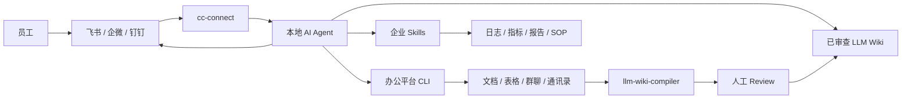

# FDE-Kit

面向 Forward Deployed Engineer（FDE）的企业 AI 工作台部署指南。

FDE-Kit 记录了一条分阶段的部署路线：把本地 AI Agent 变成团队可访问、可审查、可治理的企业 AI 助手。它把本地 Agent Runtime、`cc-connect`、办公平台 CLI、`llm-wiki-compiler` 和企业定制 Skills 串成一套可交付流程。

English version: [README.en.md](README.en.md)

## 系统架构



目标结果：

> 搭建一个团队可访问的企业 AI 工作台：它能读取授权的企业上下文，基于来源回答问题，并在明确的安全边界内执行工作流。

## 部署路线图

```text
Step 0  本地 Agent Runtime
Step 1  Chat Bridge
Step 2  企业数据访问
Step 3  LLM Wiki
Step 4  企业 Skills
Step 5  Governance
```

Step 0-3 建立基础设施。  
Step 4 产生业务价值。  
Step 5 让系统具备企业级运行边界。

## 环境要求

- macOS 或 Windows
- Node.js >= 24
- npm
- 一个本地 Agent Runtime：Claude Code、Codex、Cursor、Gemini CLI、OpenCode 或同类工具
- 一个企业聊天平台：飞书、企微、钉钉、Slack、Telegram、Discord、QQ 或同类平台
- 一批已授权的测试文档
- 一个专用工作目录

检查 Node.js：

```bash
node -v
npm -v
```

安装 Node.js：

```bash
# macOS
brew install node
```

```powershell
# Windows
winget install OpenJS.NodeJS
```

## Step 0：本地 Agent Runtime

先安装并验证一个本地 Agent Runtime，再把它接入任何企业系统。

推荐选项：

- Claude Code
- Codex
- Claude Code + 低成本模型供应商，例如 DeepSeek、GLM、Kimi

安装 Claude Code：

```bash
npm install -g @anthropic-ai/claude-code
claude --version
```

验证：

```text
Agent 能在一个专用测试目录内读写文件、执行任务。
```

## Step 1：Chat Bridge

`cc-connect` 用来把本地 Agent 暴露给团队聊天平台。

安装：

```bash
npm install -g cc-connect
cc-connect --version
```

生成与当前版本匹配的配置：

```bash
cc-connect config example > cc-connect.toml
```

先配置一个平台。以飞书为例：

```bash
cc-connect feishu setup
```

绑定已有飞书应用：

```bash
cc-connect feishu setup --app <app_id:app_secret>
```

或：

```bash
cc-connect feishu bind --app <app_id:app_secret>
```

在 `cc-connect.toml` 里重点确认：

```text
project.name
projects.agent.type
projects.agent.options.work_dir
projects.platforms.type
projects.platforms.options.app_id
projects.platforms.options.app_secret
projects.platforms.options.allow_from
```

进入团队试点前，`allow_from` 应该明确限制授权用户。

启动：

```bash
cc-connect --config ./cc-connect.toml
```

验证：

```text
用户能从聊天平台发送消息，并收到本地 Agent 的回复。
```

实现说明：这份指南优先验证飞书路径。其他平台虽然由 `cc-connect` 支持，但需要按对应平台单独验证。

## Step 2：企业数据访问

Chat Bridge 让 Agent 能被访问。企业数据访问让 Agent 真正有用。

为选定的办公平台安装 CLI、MCP Server 或内部工具适配器。第一阶段建议只读，并限制在已批准的测试空间内。

飞书 / Lark：

```bash
npm install -g @larksuite/cli
lark-cli --help
lark-cli config init
lark-cli auth login
lark-cli doctor
```

典型能力：

- 搜索文档
- 读取文档
- 读取表格
- 查询通讯录
- 向授权群聊发送进度汇报
- 上传生成的文件或图片

验证：

```text
Agent 能读取一份授权测试文档，并向一个授权群聊发送一条测试汇报。
```

## Step 3：LLM Wiki

`llm-wiki-compiler` 用来把授权源文档编译成可审查的 LLM Wiki。

安装：

```bash
npm install -g llm-wiki-compiler
llmwiki --help
```

创建测试工作区：

```bash
mkdir -p ~/fde-demo/sources
cd ~/fde-demo
```

Windows PowerShell：

```powershell
mkdir $env:USERPROFILE\fde-demo\sources
cd $env:USERPROFILE\fde-demo
```

创建 `sources/example.md`：

```markdown
# Example Company SOP

## P0 Incident Response

For P0 incidents, create an incident channel, assign an owner, check dashboards,
and post updates every 15 minutes.

## External SaaS Subscription

Employees should confirm with finance before subscribing to external SaaS tools.
```

编译：

```bash
llmwiki schema init
llmwiki compile --review --lang zh-CN
llmwiki review list
llmwiki review show <candidate-id>
llmwiki review approve <candidate-id>
llmwiki lint
llmwiki view
```

查询：

```bash
llmwiki query "P0 事故应该怎么处理？"
```

验证：

```text
已记录的问题能从已审查 Wiki 内容中回答。
未记录的制度问题会被标记为“未文档化”，而不是被编造。
```

## Step 4：企业 Skills

Skills 把基础设施转化成业务工作流。

一个 Skill 是一套可重复执行的流程，包含：

- 触发条件
- 输入
- 授权工具
- 执行步骤
- 输出格式
- 权限边界
- 失败处理

### 日志诊断 Skill

触发：

```text
Investigate this failed request: trace_id=xxx
```

流程：

```text
1. 校验 trace ID。
2. 查询授权日志。
3. 识别 request path、user scope 和 error class。
4. 必要时检查相关指标。
5. 输出诊断结论和下一步动作。
6. 如有需要，汇报到授权群聊。
```

### API 交付验收 Skill

触发：

```text
Verify this API change before delivery.
```

流程：

```text
1. 读取需求和 API path。
2. 运行测试。
3. 发送 smoke request。
4. 检查日志和指标。
5. 输出 pass / fail / risk 报告。
```

### 内容审核 Skill

触发：

```text
Review this batch of user-generated content.
```

流程：

```text
1. 读取授权数据。
2. 应用审核标准。
3. 输出结构化审核决策。
4. 写入授权目标位置。
5. 标记需要人工复核的样本。
```

### 竞品监控 Skill

触发：

```text
Summarize recent competitor activity.
```

流程：

```text
1. 读取授权关键词和竞品列表。
2. 搜索公开来源。
3. 提取标题、互动数据和核心主张。
4. 聚类选题方向。
5. 向授权群聊输出报告。
```

### SOP 执行 Skill

触发：

```text
Run the release checklist.
```

流程：

```text
1. 读取已批准 SOP。
2. 检查必要项目。
3. 确认负责人。
4. 确认回滚和监控方案。
5. 输出 go / no-go 摘要。
```

### Wiki 更新 Skill

触发：

```text
Convert this incident review into wiki updates.
```

流程：

```text
1. 提取 timeline、impact、cause 和 fix。
2. 起草 postmortem。
3. 起草可复用 Incident Pattern。
4. 提交人工 review。
5. 审批后发布。
```

验证：

```text
至少一个 Skill 能端到端完成真实工作流，并产出可审计报告。
```

## Step 5：Governance

最低运行控制：

- 专用 OS 用户或隔离服务器
- 专用工作目录
- Chat allowlist
- Source document allowlist
- 第一次集成优先只读
- Wiki 发布前必须人工 review
- Sources 中不放 secrets、credentials、contracts、salary、private customer data
- Unknown-question capture process
- 定期 wiki lint 和 review

验证：

```text
Agent 能回答已知问题，拒绝未文档化问题，并只在预期数据边界内运行。
```

## LLM Wiki vs Direct RAG

| Dimension | Direct RAG | LLM Wiki |
|---|---|---|
| Knowledge form | Query-time chunks | Precompiled Markdown pages |
| Reviewability | Usually answer-level only | Wiki pages can be reviewed before use |
| Source traceability | Depends on retrieval | Built into pages and citations |
| Reuse | Re-discovered per query | Accumulates as stable knowledge assets |
| Best for | Large ad-hoc search | SOPs, policies, incident reviews, manuals |
| Main risk | Plausible but unapproved answers | Slower setup, stronger control |

FDE-Kit 不替代 RAG。它定义的是：什么时候企业知识应该先变成可审查资产，再交给 Agent 使用。

## Delivery Checklist

```text
[ ] Step 0: Local Agent works inside a test directory
[ ] Step 1: cc-connect bridges chat to the Agent
[ ] Step 2: Agent can access one approved test document
[ ] Step 3: LLM Wiki compiles and answers from reviewed content
[ ] Step 4: One enterprise Skill completes a real workflow
[ ] Step 5: Permissions, review, and operations are documented
```

## Public Safety Baseline

公开示例只使用通用数据。

避免发布：

- 真实项目名
- 内部域名
- 生产路径
- 员工信息
- 客户信息
- secrets 或 credentials
- 原始事故记录
- 未发布商业计划

## Scope

FDE-Kit 是 FDE 风格企业 AI 工作台项目的部署指南和运行模型。

当前范围：

- 分阶段部署指南
- 运行边界
- 可审查知识工作流
- Skill 设计示例

暂不包含：

- SaaS UI
- 一键安装脚本
- 自动导入未经审查的公司文档
- 对未批准来源的回答正确性保证

预期结果是一条从本地 Agent 到企业 AI 工作台的可控路径。
